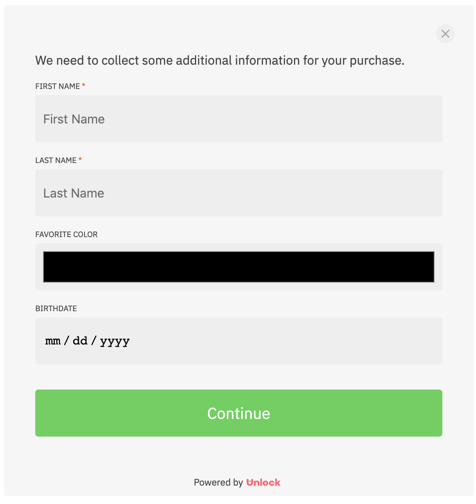

# Advanced Paywall Configuration

## Collecting User Metadata

In some cases, it may be valuable to collect information from purchasers before they purchase a key. For example, you may want to know the email address of all keyholders so that you can send updates to them.

To achieve this, add a property called `metadataInputs` to your configuration object:

```
{
  ...
  metadataInputs: [ /* input fields */ ],
  ...
}
```

The members of this array should have the following shape:

```bash
{
  name: string,
  type: 'text' | 'date' | 'color' | 'email' | 'url',
  required: boolean,
  public?: true,
}
```

All fields are required except for `public`, which defaults to `false`. Metadata is considered protected by default, so the only people who can view it are the lock owner and the user associated with the metadata. If any metadata should be visible to everyone, mark the `public` field as `true`.

If any input has `required: true`, it will render on the form with a red asterisk next to it and the metadata form will not submit until it is filled appropriately.

Name fields should be unique; if they are not then there may be collisions when storing the data.

The `type` field maps to a certain subset of HTML `<input>` types, which influences how the form renders \(see image\).



After the user fills out the form and clicks the Continue button, they will be prompted to sign a message so the data can be verified as coming from then. After they sign, the key purchase will initiate.

